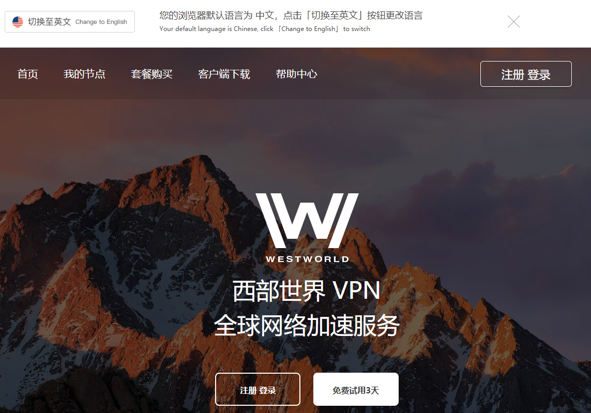
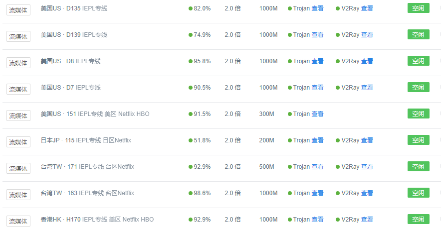
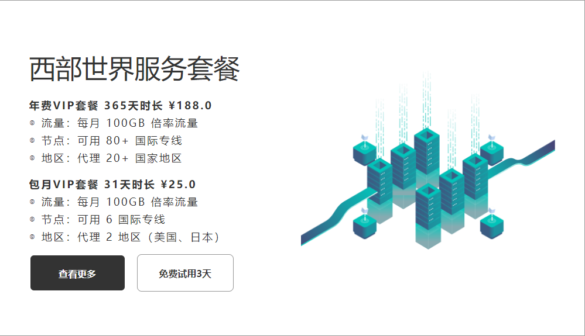
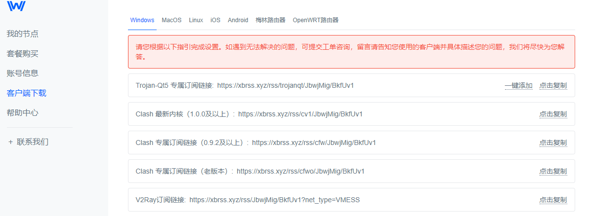
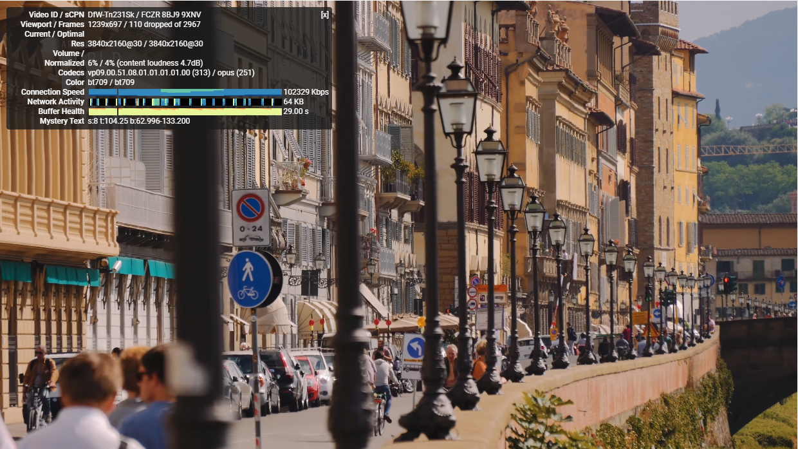

# 梯子软件中便宜稳定的性价比之选，好用的电脑和手机梯子西部世界（Westworld）
好用稳定的梯子软件,收费梯子推荐,付费梯子推荐,免费梯子推荐,性价比最高的VPN,速度快的VPN,中国能用的梯子VPN,电脑梯子推荐,手机梯子推荐,免费ssr节点,免费V2ray节点,免费Trojan节点,科学上网软件,科学上网工具，免费ssr工具,西部世界Westword梯子官网,Westworld VPN吗,翻墙方法,翻墙教程

### Hello大家好，我是晴天，今天给大家测评下一款知名度比较高的梯子软件，看看这个机场梯子软件的网络稳定性，易用性以及是否好用。

在测评之前，特别鸣谢网友**喵呜**提供了年费的西部世界VPN账号。

这期关于**好用的梯子测评**的主角是大家应该都不陌生的西部世界，我本人也在几年前断断续续使用过这个翻墙梯子软件，之前给我的感觉还是不错的，只是后来随着测评的梯子增多，也在频繁更换梯子使用，后来就一直没有再去使用它。

直到最近陆陆续续有几个朋友让我测评下这个梯子软件，才终于有了这一期的测评。

### 官网地址：[点击访问官网](https://xbsj4621.fun/i/ems010)

首先看一下westworld VPN的官网主页：

主页分为中英双语，在最上方可以切换，同时能够看到，西部世界的这家梯子提供对于新用户的三天免费试用时间，这个在我遇到的所有梯子当中，对用户而言是比较友好的，三天时间足够对一款[翻墙梯子软件](https://www.taoxinbi.com/article/5846.html)做出足够且全面的了解。

其实我最开始使用他家梯子的时候，那会儿还是有ssr节点存在的，不过这次登录之后，ssr节点全部下线，更换为Trojan节点和V2ray节点，不过这对于使用者而言，是一件值得庆幸的事情，毕竟Trojan和V2ray在防封性能和稳定性上而言，要优于ssr。

本次测评会从多维度对该机场进行考察和测评，客观评价其稳定性以及是否好用，最后结合其价格来做出一个大致的性价比高还是低的判断。

**声明：本次测评无任何利益挂钩，并且未收取任何费用，仅仅是给大家一个客观的测评结果作为参考，最终是否使用该梯子软件，请大家自行决定。**

## 一、Westworld梯子的注册

Westworld和其他一部分梯子一样，采取了匿名邮箱注册的方式，在注册界面的邮箱栏，你可以不填写真实邮箱，随意编写邮箱地址作为账号即可，只是自己要记住，并且不需要邮箱验证登录。

## 二、关于这个梯子软件的一些节点信息

目前西部世界这个梯子的后台节点有89条，这个数量在所有的机场服务商中算是比较多的，并且节点的分类比较完善，地区遍及美国、日本、俄罗斯、西班牙、新加坡、瑞士、波兰等等一系列国家。

同时后台也有能够解锁Netflix的奈飞流媒体专线，对于追剧来说十分友好，我测试了他们的流媒体线路，对比我之前用过的其他几家支持流媒体观看的梯子软件而言，他家大线路在网络的稳定性和网速上表现的要更好一些，观看过程中全程没有出现卡顿。

他们的所有线路近乎都是清一色的IEPL专线，这种线路就是在高峰期不需要和别人争抢网络通道，能够导致全天24小时的网速一致性，在测试的过程中确实也能够体会到这一点。

## 三、关于这款梯子的服务时长

相信大家和我一样，对于一款梯子是否稳定好用或者靠谱的评判标准，第一步肯定是先考虑它的运营时长，一款刚出来几个月的梯子，就算再好用，速度再快，别人再怎么推荐，我也是很难对他保持信任度，西部世界这个梯子我在网上搜索过，最早出现的时间点应该是在三年前，从这点来看，至少还是比较靠谱的，因为经过三年的市场洗礼，如果不好用应该早就被淘汰了。

## 四、关于这款梯子的价格问题

这款梯子的后台计费模式有月费和年费两种，月费是25RMB，年费188RMB，这个价格在所有的机场软件当中都不算高，定价还是比较中规中矩的。

## 五、稳定好用的梯子客户端推荐，支持ios-windows-mac-安卓-Linux-路由器

后台的客户端种类齐全，不管是你喜欢用[电脑梯子](https://bbs.2iwm.com/d/217)还是手机梯子，也不管你是想在ios上用梯子还是安卓手机上用梯子，都能找到对应的客户端并且下载使用，值得一提的是，如果你想找一款**好用的mac端梯子软件**，或者**Trojan节点梯子**，那么用它准没错，西部世界的mac梯子客户端不管是性能还是UI设计，都应该是我见过的梯子当中首屈一指的。

## 六、速度测评，针对一款梯子软件是否好用的最终考核标准

先说一下我的测速网络环境：

**本地环境：**

网络宽带：广电70M网络

测试时间：晚9点20分

测试节点：年费美国节点

**测速平台一：Youtube  清晰度：4K**

4K视频播放没有任何压力，缓冲进度也能超前，这梯子软件的速度还是很不错的。

**测速平台二： SpeedTest**

  ### 以上就是针对西部世界VPN这个平台的全部测评结果，综上所述，其实这款软件从性价比而言是很高的，能够称得上是一款好用稳定的网络翻墙梯子加速器，并且后台也支持游戏节点，我试了两把，延迟很低，完全能够满足游戏的需要，大家可以试试这款梯子，然后结合自己的实际使用感受，确定是否购买。
